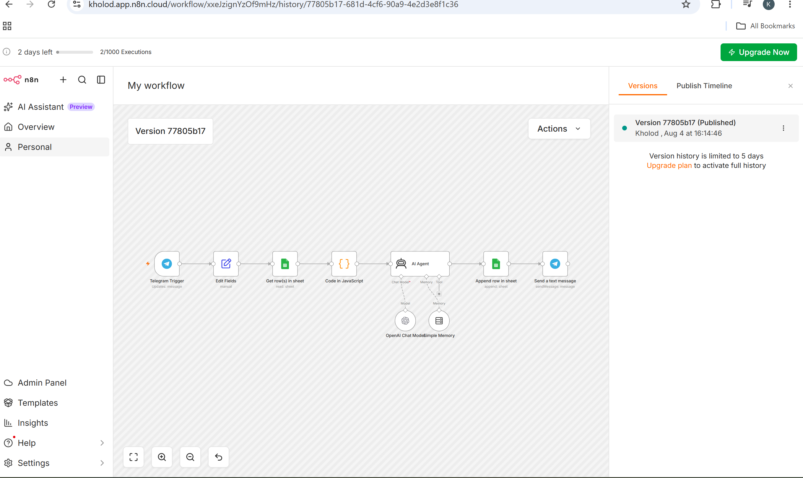

# Telegram AI Knowledge Assistant using n8n

An AI-powered Telegram knowledge assistant built with n8n, OpenAI, Google Sheets, and JavaScript.

The assistant receives employee questions through Telegram, retrieves relevant information from a structured knowledge base, generates a grounded response using an AI Agent, logs the interaction, and sends the answer back to the user.

## Project Overview

This project demonstrates how AI and workflow automation can be combined to build an automated knowledge assistant for employee support.

Instead of answering questions from unrestricted model knowledge, the assistant retrieves information from a predefined knowledge base and instructs the AI Agent to generate responses based only on the retrieved information.

## Workflow Overview

## Features

- Telegram chatbot interface
- Knowledge-grounded responses using OpenAI
- Google Sheets as a structured knowledge base
- Keyword-based knowledge retrieval
- Conversation memory
- JavaScript-based retrieval and data processing
- Conversation logging
- Automated workflow orchestration with n8n
- Continuous production execution

## Workflow Architecture

Telegram Trigger  
→ Edit Fields  
→ Retrieve Knowledge from Google Sheets  
→ JavaScript Knowledge Matching  
→ AI Agent + OpenAI Chat Model  
→ Log Conversation in Google Sheets  
→ Send Response via Telegram

## Technologies Used

- n8n
- Telegram Bot API
- OpenAI
- Google Sheets
- JavaScript
- AI Agent
- Simple Memory

## How It Works

1. A user sends a question to the Telegram bot.
2. The Telegram Trigger receives the incoming message.
3. The workflow extracts the question, username, and chat ID.
4. Knowledge-base records are retrieved from Google Sheets.
5. JavaScript compares the user's question with the available questions and keywords to identify the most relevant knowledge.
6. The retrieved answer is passed to the AI Agent as context.
7. The AI Agent generates a concise response grounded in the retrieved knowledge.
8. The interaction is logged in Google Sheets.
9. The final response is sent back to the user through Telegram.

## Setup

1. Import the provided workflow JSON file into n8n.
2. Configure your Telegram Bot credentials.
3. Configure your OpenAI credentials.
4. Connect your Google Sheets account.
5. Create a structured knowledge-base sheet.
6. Configure the required spreadsheet and sheet IDs.
7. Test the workflow.
8. Publish the workflow.

> Credentials and private resource identifiers have been replaced with placeholders in the public workflow file.

## Security

API keys, authentication tokens, OAuth credentials, webhook identifiers, and private spreadsheet identifiers are not included in this repository.

Users must configure their own credentials after importing the workflow into n8n.

## Future Improvements — V2 RAG

The next version will evolve the current structured retrieval approach into a full Retrieval-Augmented Generation (RAG) architecture.

Planned improvements:

- Vector database integration
- OpenAI embeddings
- Semantic search
- Document chunking and retrieval
- PDF knowledge-base support
- Source citations
- Arabic and English knowledge retrieval
- Document upload through Telegram
- User access control
- Persistent conversation memory

## Project Status

**V1 — Functional Prototype Completed**

The current version uses structured knowledge retrieval with Google Sheets and JavaScript-based matching.

**V2 — Planned: Vector RAG Architecture**
